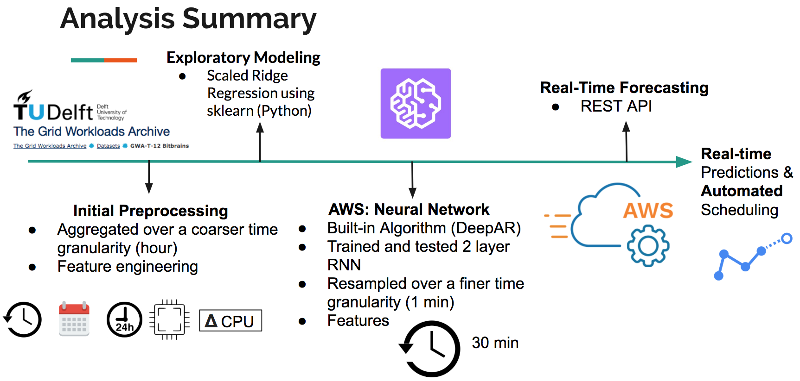
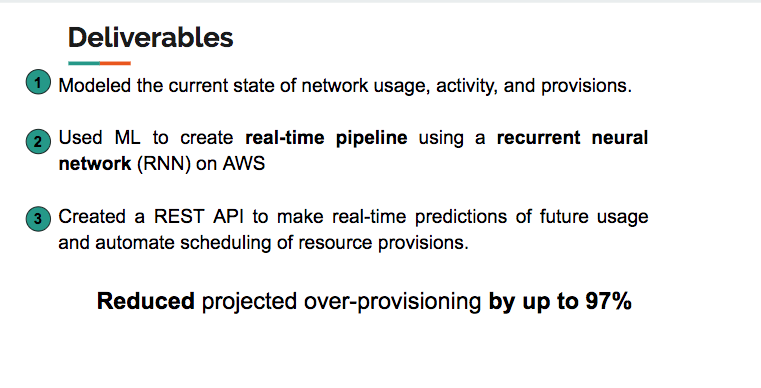

# Modeling System Resource Usage for Predictive Scheduling
### A machine learning-based solution for real-time resource allocation in the cloud
**Consulting Project with [Manifold.co](Manifold.co)**

**Accompanying Blog Post on my website [here](https://jessierayebauer.wixsite.com/jrbauer/single-post/2018/06/26/Modeling-System-Resource-Usage-for-Predictive-Scheduling)**

**This repo shows how I translated Manifold’s business objectives into an actionable deliverable.**

## Project Summary
As an Insight Data Science Fellow, I consulted with Manifold for a project using machine learning and neural networks to model and predict resource usage. Manifold is a company that offers startups and new developers a simple yet revolutionary platform to manage their applications and cloud resources in one place. Manifold also serves as a marketplace for additional applications and services, as well as an easy way to work with multiple APIs in one location.

As a consultant, I wanted to get a sense of Manifold’s needs to help them reach their goals. Manifold was interested in gaining a sense of their current network resource usage and provisioning. In addition, Manifold wanted to move towards a machine learning approach to make real-time usage predictions and automate scheduling of provisions. This is especially important because they were spending valuable hours manually setting limits, at a continuously high resource limit to minimize downtime (i.e., system crashing). Historically, companies like manifold have to balance the competing needs of minimizing cost of paying for CPU bandwidth, for example, but also minimizing downtime by slightly over provisioning. This was even evidenced in the [publicly available dataset](http://gwa.ewi.tudelft.nl/datasets/gwa-t-12-bitbrains) I used for my data analysis, because of an NDA agreement. Therefore, my role as a consultant was to develop a model that will provide a more intelligent prediction of resource usage.

Here is how I translated Manifold’s business objectives into an actionable deliverable.

First, I used time-series analysis, advanced regression techniques, and time series cross-validation in Python (using sklearn) to characterize resource usage as well as to identify important predictive features.

Next, I implemented DeepAR, a recently developed built-in algorithm from Amazon Sagemaker (hosted on AWS) to help Manifold shift towards real-time analytics. Amazon SageMaker DeepAR is a supervised learning algorithm used to forecast time series using recurrent neural networks (RNN). 

## Overview of my analysis pipeline:

## Summary of the deliverables I provided to Manifold:

## Notebook Organization

1. [Manifold_TimeSeries_Models.py](https://github.com/JessieRayeBauer/Time-Series-Forecasting-/blob/master/Manifold_TimeSeries_Models.py.ipynb): - Modeling 500 time series using sklearn. Techniques include feature engineering, rolling window averages (smoothing), linear regression, scaled regression, and lasso, and ridge regression to perform feature selection and reduce overfitting.

2. [Manifold_AWS_DeepAR.py](https://github.com/JessieRayeBauer/Time-Series-Forecasting-/blob/master/Manifold_AWS_DeepAR.py.ipynb): AWS Jupyter notebook for Sagemaker DeepAR. Includes code to download and read in data, format into JSON strings, push to S3 bucket, create train a recurrent neural network (RNN), and visualize model predictions. 

3. [Manifold_Visualize_Initial_Explore.py.ipynb](https://github.com/JessieRayeBauer/Time-Series-Forecasting-/blob/master/Manifold_Visualize_Initial_Explore.py.ipynb): - Includes some initial visualizations of data (aggregated and resampled hourly) using python and matplotlb.

4. [Timeseries_FirstLook_1month.py.ipynb](https://github.com/JessieRayeBauer/Time-Series-Forecasting-/blob/master/Timeseries_FirstLook_1month.py.ipynb) - Contains code for exploring timeseries from 1 month and 100 VMs. Includes initial models using ARIMA, SARIMAX, Holt-Winters (smoothing), some visualizations, and stationarity tests.

5. [HyperparameterTuning_DeepAR_Example.ipynb](https://github.com/JessieRayeBauer/Time-Series-Forecasting-/blob/master/HyperparameterTuning_DeepAR_Example.ipynb): Example code for hyperparameter tuning request in AWS sagemaker. 

## Helpful Resources

1. Data publically available from The Grid Workloads Archive ([Bit Brains](http://gwa.ewi.tudelft.nl/datasets/gwa-t-12-bitbrains)- I used the rnd traces)

2. [AWS Sagemaker Documentation](https://docs.aws.amazon.com/sagemaker/latest/dg/deepar.html)

3. Helpful blog and source of some code [here](https://medium.com/open-machine-learning-course/open-machine-learning-course-topic-9-time-series-analysis-in-python-a270cb05e0b3)

4. [ARIMA description](http://dacatay.com/data-science/part-4-time-series-prediction-arima-python/)

